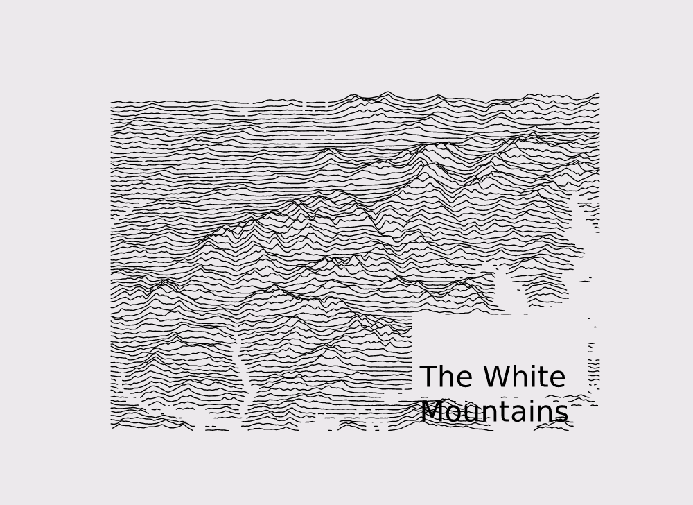
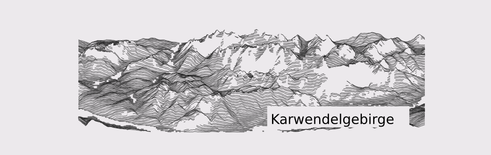
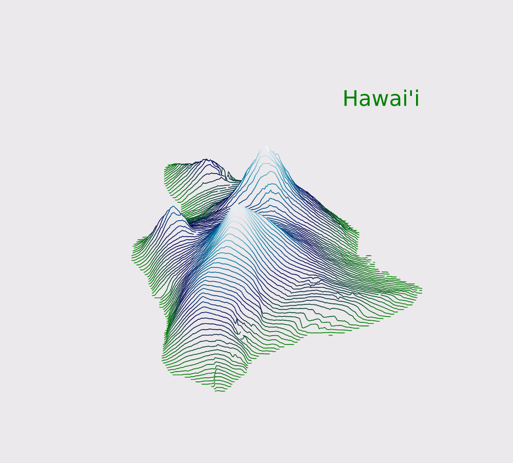
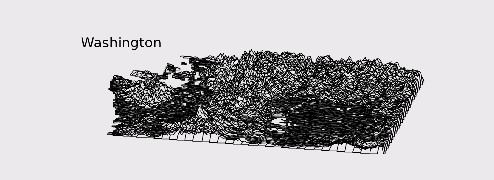

# ridge-redux

*Ridgeline plots of ridges — in Rust, in your browser.*

A Rust port of the delightful Python package
[ridge_map](https://github.com/ColCarroll/ridge_map) ("3D maps with 1D lines"),
replacing matplotlib with a webapp: a Rust backend owns the entire terrain
pipeline (SRTM download → sampling → rotation → water/lake masking) and a
minimal canvas frontend lets you **navigate, rotate and style the landscape**
into artwork, then export it as vector SVG or PNG.



## Quick start

```bash
cargo run --release -p ridge-server -- --web-dir web
# open http://127.0.0.1:8420
```

On first use the server downloads SRTM elevation tiles on demand and caches
them under `~/.cache/ridge-redux/srtm/` (one fetch per tile, ever).
Drag to pan, wheel to zoom — both instant, purely client-side. The
**viewpoint-angle, water and relief sliders are also instant**: the server
ships the raw elevation grid once per location/resolution
(`POST /api/elevation`), and the browser rotates it about its center, masks
water/lakes and rebuilds the ridge lines locally, throttled to animation
frames. Only changing the location or resolution hits the network.

**Export**: `SVG` downloads vector artwork straight from the backend;
`PNG` rasterizes it at 2× resolution in the browser.

**Map picker**: the sidebar hosts an OpenStreetMap slippy map — drag on it
to draw the bounding box, which syncs both ways with the coordinate inputs
and presets. Areas beyond SRTM coverage (|φ| > 60°) are shaded out and
drawn selections are clamped to the covered band.

**Rotation model** (all client-side, one elevation fetch): the backend ships
a rotation-invariant **disc** of samples — a square region around your bbox
center masked to the inscribed circle (span = the bbox diagonal by default,
adjustable). Both view modes are then just windows over that disc, rotated
about its center:

- **Rectangle** — a fixed `num_lines × elevation_pts` window; identical
  style, spacing and ratios at every angle, with previously unused points
  rotating into frame as it sweeps around.
- **Full disc** — shows the whole circle (square figure).

No zoom compensation, no re-requesting: the point count inside the window is
constant at every angle (±<2%, just coastline voids rotating at the rim).

## Examples

All of these were produced by this repo (the same bboxes and parameters as the
upstream README):

| | |
|---|---|
|  |  |
| Karwendelgebirge (SRTM3 fallback) | Hawai'i, `ocean` colormap, `kind=elevation` |
|  | The default: The White Mountains |

You can also render headless with the CLI (great for piping to a file):

```bash
cargo run --release -p ridge-core --bin render -- \
  --bbox "11.098251,47.264786,11.695633,47.453630" \
  --num-lines 150 --vertical-ratio 240 --lake-flatness 2 \
  --label "Karwendelgebirge" --label-x 0.55 --label-y 0.1 --label-size 40 \
  --out karwendel.svg
```

Run `render --help` for every knob (bbox, viewpoint angle, colormaps,
water percentile, annotations, …).

## Architecture

```
┌────────────────────────── backend (Rust) ──────────────────────────┐
│ ridge-core                       ridge-server (axum)               │
│ ├─ srtm: .hgt fetch/parse/cache  ├─ POST /api/elevation → raw grid │
│ │   (SRTM1 → SRTM3 fallback,     ├─ POST /api/preview  → JSON      │
│ │    zip support, disk cache)    ├─ POST /api/export.svg → SVG     │
│ ├─ grid sampling (=srtm.py)      ├─ GET  /api/presets, /healthz    │
│ │   rect + rotation-invariant                                      │
│ │   disc regions                                                   │
│ ├─ rotate (=scipy order 0/1)     ├─ static frontend + gzip         │
│ │   + rotate_fixed_plane         └─ in-memory grid cache (LRU)     │
│ ├─ preprocess (water/lakes)                                        │
│ ├─ geometry → RidgeScene                                           │
│ └─ colormaps + SVG writer                                          │
└────────────────────────────┬───────────────────────────────────────┘
                             │ raw grid (integers, voids→null), JSON geometry
┌────────────────────────────▼── frontend (vanilla JS canvas) ───────┐
│ ONE fetch per location/resolution, then everything is local:       │
│ ├─ rotatePlane(): spin the grid about its center (fixed canvas)    │
│ ├─ preprocessLocal(): water percentile + lake gradient masks       │
│ ├─ rows + matplotlib-parity layout, drawn back-to-front            │
│ └─ pan/zoom = view transform; angle slider runs at frame rate      │
└────────────────────────────────────────────────────────────────────┘
```

Division of labor: the server owns anything that needs tiles or
authoritative export (sampling, SVG). The browser owns everything
per-interactive-frame: rotation about the landscape center (the plane never
moves, so zoom/distance stay fixed), water/lake masking, and drawing. A
parity test (`scripts/parity_frontend.mjs`) proves the JS pipeline matches
the Rust one bit-for-bit (worst delta 0.0 on a rotated fixture). No WASM —
a 300×300 grid pipelines in a few milliseconds of plain JS; if you ever
want 1000×1000 at frame rate, `ridge-core` is structured to compile to WASM
via wasm-bindgen and drop in.

## API

`POST /api/preview` — body is a JSON `RenderParams` (all fields optional,
see [`crates/ridge-server/src/api.rs`](crates/ridge-server/src/api.rs)):

```jsonc
{
  "bbox": [-71.93, 43.76, -70.96, 44.47],   // (lon, lat, lon, lat)
  "num_lines": 80, "elevation_pts": 300,
  "viewpoint_angle": 0, "crop": false, "interpolation": 0,
  "water_ntile": 10, "lake_flatness": 3, "vertical_ratio": 40,
  "linewidth_pt": 2,
  "line_color": "black",     // name | "#0f0f0f" | colormap: viridis, ocean, ...
  "kind": "gradient",        // or "elevation"
  "background_color": "#ece8ec",
  "label": "The White\nMountains", "label_x": 0.62, "label_y": 0.15,
  "label_size_pt": 60,
  "annotation": { "lon": -71.3173, "lat": 44.2946, "label": "Mt Washington" }
}
```

Response: `{ shape, rows: [{baseline, y[...]}], vmin, vmax, layout, style }`
where `y` values are `null` across water/gaps. The frontend maps `layout`
into canvas coordinates and paints rows back-to-front with a background-color
fill under each line — the same occlusion trick as upstream `fill_between`.

`POST /api/export.svg` takes the identical body and returns standalone SVG.
`GET /api/presets` lists 10 curated locations (same as the upstream README).

## Fidelity to upstream

The port is deliberately faithful — the odd corners are reproduced:

- **lake flatness is computed on floats with spatial coherence**: the
  gradient runs on normalized floats (threshold `lake_flatness/255`, same
  semantics as upstream's u8 rank gradient but without its rounding
  terraces), water/NaN cells are excluded from the neighborhoods (skimage's
  `mask` parameter — so flat shores merge into the water body instead of
  forming a drawn perimeter), and lake candidates survive only as connected
  components of ≥12 cells — no speckle holes on rolling hills,
- **the water percentile ignores NaN padding**: in disc mode ~21% of the
  sample square is padding; computing the percentile over it would pin the
  water level to zero and erase every river and stream, so it is measured
  over in-disc terrain only,
- **masks are decided before rotation**: water percentile, lake mask and
  normalization run once on the unrotated disc, and the masked grid is then
  rotated for display — decisions attach to physical locations, so nothing
  flickers as the angle changes,
- sampling uses `lat0 + r/N * dlat` (stops one step short of the far corner),
- viewpoint angles in (45°,135°) ∪ (225°,315°) swap `num_lines`/`elevation_pts`,
- rotation fills out-of-bounds samples with `0.0` (scipy `mode='constant'`),
- percentiles use numpy's linear interpolation; lake detection quantizes to
  u8 before the 3×3 morphological gradient (skimage `rank.gradient`),
- rows are flipped (south in front) and scaled by `vertical_ratio`,
- lines step `-6` per row, colored by row index (gradient) or elevation.

The golden test compares our sampled White Mountains grid against the upstream
test fixture ([`test/test_data/new_hampshire.npz`](https://github.com/ColCarroll/ridge_map/tree/main/test/test_data)) — **0/24000
mismatches**, i.e. bit-for-bit identical sampling to Python + srtm.py.

## Development

```bash
cargo test --release              # 37 tests: units + API integration + parity
node scripts/test_frontend.mjs    # frontend logic against a stubbed DOM
node scripts/parity_frontend.mjs  # JS pipeline == Rust pipeline (bit-for-bit)
scripts/fetch_fixtures.sh         # fetch tiles for the golden parity test
cargo run -p ridge-core --example debug_tile     # connectivity diagnostics
cargo run -p ridge-core --example dump_plane_fixture  # fixture for the parity check
```

- Offline/demo mode: `--fixture-dir fixtures/srtm` (server) or
  `--fixture-dir` + `DirSource` in code.
- Mirrors are configurable: `--srtm-base "URL1,URL2"` (default: kurviger
  SRTM1, falling back to the global SRTM3 set).
- Font: labels use [Cinzel](https://fonts.google.com/specimen/Cinzel), loaded
  from Google Fonts by the frontend. SVG export references the family by name
  (browsers fetch it); server-side rasterization falls back to serif.

## License

MIT, like upstream ridge_map (see `LICENSE-upstream` for the original
project's license text).

Elevation data: NASA [Shuttle Radar Topography Mission](https://www2.jpl.nasa.gov/srtm/),
available between 60°N and 60°S.
